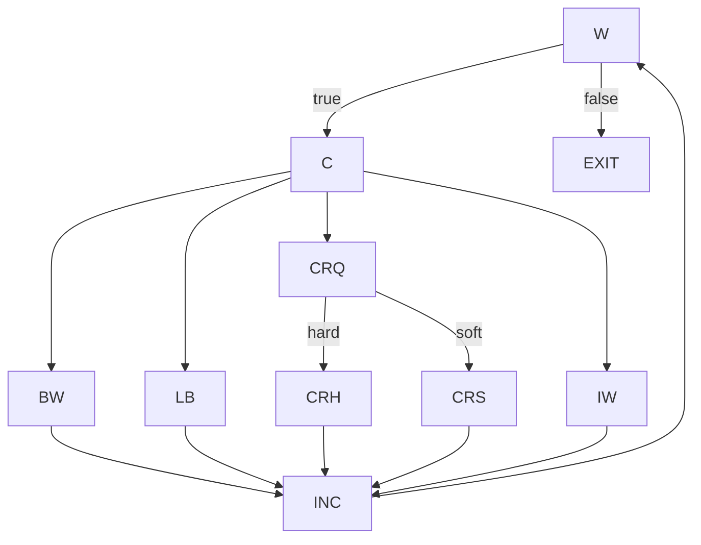

# Ejercicio 3

Se trabaja sobre el método `fmtRewrap()` ubicado en:

- `tp4/assignmnet-4-rodeghiero/src/main/java/assignment4_exercises/FmtRewrap.java`

### Modelo de CFG utilizado

Para que el análisis sea legible y manejable, se utiliza un CFG por bloques en lugar de uno a nivel de instrucción individual. Los nodos del modelo son los siguientes:

- `W`: condición del `while`.
- `C`: clasificación del carácter actual (cadena de `if/else if` sobre `col`, `CR`, `' '` e `inWord`).
- `BW`: caso `betweenWord`.
- `LB`: caso `lineBreak`.
- `CR?`: caso `crFound`, que internamente toma una decisión.
- `CRh`: rama hard-CR (cuando `i+1 < len && next == CR`).
- `CRs`: rama soft-CR (rama else del caso anterior).
- `IW`: caso `inWord` o por defecto.
- `INC`: incremento `i++`.
- `EXIT`: ejecución de `S = new String(SArr) + CR; return`.

El CFG resultante es:

### (a) CFG del método

El CFG del método es exactamente el grafo presentado más arriba.

### (b) Test que va del comienzo del `while` a `EXIT` sin entrar al cuerpo

Un caso válido para esto es:

- `t = ("", 10)`

Justificación: cuando `S = ""` la condición del `while` evalúa `i < S.length()` como `0 < 0`, lo cual es falso. Por lo tanto el flujo toma directamente el arco `W -> EXIT` sin pasar por ningún nodo intermedio del cuerpo del bucle.

### (c) Requisitos de tests para NC, EC y PPC

**NC (cobertura de nodos):**

- `{W, C, BW, LB, CR?, CRh, CRs, IW, INC, EXIT}`

**EC (cobertura de arcos):**

1. `(W, C)`
2. `(W, EXIT)`
3. `(C, BW)`
4. `(C, LB)`
5. `(C, CR?)`
6. `(C, IW)`
7. `(BW, INC)`
8. `(LB, INC)`
9. `(CR?, CRh)`
10. `(CR?, CRs)`
11. `(CRh, INC)`
12. `(CRs, INC)`
13. `(IW, INC)`
14. `(INC, W)`

**PPC (caminos principales sobre el CFG reducido):** se obtienen 47 prime paths.

1. `[W, C, BW, INC, W]`
2. `[W, C, LB, INC, W]`
3. `[W, C, IW, INC, W]`
4. `[W, C, CR?, CRh, INC, W]`
5. `[W, C, CR?, CRs, INC, W]`
6. `[C, BW, INC, W, C]`
7. `[C, BW, INC, W, EXIT]`
8. `[C, LB, INC, W, C]`
9. `[C, LB, INC, W, EXIT]`
10. `[C, IW, INC, W, C]`
11. `[C, IW, INC, W, EXIT]`
12. `[C, CR?, CRh, INC, W, C]`
13. `[C, CR?, CRh, INC, W, EXIT]`
14. `[C, CR?, CRs, INC, W, C]`
15. `[C, CR?, CRs, INC, W, EXIT]`
16. `[BW, INC, W, C, BW]`
17. `[BW, INC, W, C, LB]`
18. `[BW, INC, W, C, IW]`
19. `[BW, INC, W, C, CR?, CRh]`
20. `[BW, INC, W, C, CR?, CRs]`
21. `[LB, INC, W, C, BW]`
22. `[LB, INC, W, C, LB]`
23. `[LB, INC, W, C, IW]`
24. `[LB, INC, W, C, CR?, CRh]`
25. `[LB, INC, W, C, CR?, CRs]`
26. `[CR?, CRh, INC, W, C, BW]`
27. `[CR?, CRh, INC, W, C, LB]`
28. `[CR?, CRh, INC, W, C, CR?]`
29. `[CR?, CRh, INC, W, C, IW]`
30. `[CR?, CRs, INC, W, C, BW]`
31. `[CR?, CRs, INC, W, C, LB]`
32. `[CR?, CRs, INC, W, C, CR?]`
33. `[CR?, CRs, INC, W, C, IW]`
34. `[CRh, INC, W, C, CR?, CRh]`
35. `[CRh, INC, W, C, CR?, CRs]`
36. `[CRs, INC, W, C, CR?, CRh]`
37. `[CRs, INC, W, C, CR?, CRs]`
38. `[IW, INC, W, C, BW]`
39. `[IW, INC, W, C, LB]`
40. `[IW, INC, W, C, IW]`
41. `[IW, INC, W, C, CR?, CRh]`
42. `[IW, INC, W, C, CR?, CRs]`
43. `[INC, W, C, BW, INC]`
44. `[INC, W, C, LB, INC]`
45. `[INC, W, C, IW, INC]`
46. `[INC, W, C, CR?, CRh, INC]`
47. `[INC, W, C, CR?, CRs, INC]`

### (d) Suite para NC pero no EC

La suite implementada se encuentra en:

- `tp4/assignmnet-4-rodeghiero/src/test/java/assignment4_exercises/FmtRewrapNodeCoverageTest.java`

Comando de ejecución:

- `JAVA_HOME=$(/usr/libexec/java_home -v 17) mvn -Dmaven.repo.local=.m2 -Dtest=FmtRewrapNodeCoverageTest test`

Resultado de JaCoCo sobre `fmtRewrap`:

- `LINE: 29/29`
- `BRANCH: 16/16`

**Observación:** con esta implementación particular del método y con el nivel de modelado utilizado, una suite que cubre todos los nodos de sentencias termina cubriendo también todos los arcos que mide la herramienta. En la práctica, no fue posible obtener una suite que cumpliera NC sin cumplir EC al mismo tiempo según la medición de JaCoCo. Esto se debe a que muchas sentencias y ramas están tan acopladas que llegar al nodo correspondiente implica recorrer también su arco saliente.

### (e) Suite para EC pero no PPC

La suite implementada se encuentra en:

- `tp4/assignmnet-4-rodeghiero/src/test/java/assignment4_exercises/FmtRewrapEdgeButNotPrimePathCoverageTest.java`

Comando de ejecución:

- `JAVA_HOME=$(/usr/libexec/java_home -v 17) mvn -Dmaven.repo.local=.m2 -Dtest=FmtRewrapEdgeButNotPrimePathCoverageTest test`

Resultado de JaCoCo sobre `fmtRewrap`:

- `LINE: 29/29`
- `BRANCH: 16/16` (que en esta herramienta funciona como equivalente práctico de EC).

**Por qué la suite no cumple PPC** (sobre el CFG definido más arriba):

- La suite no recorre el prime path `[BW, INC, W, C, IW]`. Intuitivamente, cada vez que entra a `BW`, la siguiente iteración relevante del bucle pasa por `LB` en lugar de `IW`, por lo que esa secuencia particular nunca aparece en los caminos ejecutados.

### (f) Suite para PPC con Best Effort Touring

La suite implementada se encuentra en:

- `tp4/assignmnet-4-rodeghiero/src/test/java/assignment4_exercises/FmtRewrapPrimePathBestEffortCoverageTest.java`

Comando de ejecución:

- `JAVA_HOME=$(/usr/libexec/java_home -v 17) mvn -Dmaven.repo.local=.m2 -Dtest=FmtRewrapPrimePathBestEffortCoverageTest test`

Resultado de JaCoCo sobre `fmtRewrap`:

- `LINE: 29/29`
- `BRANCH: 16/16`

Análisis de prime paths sobre el CFG definido:

- Cantidad total de prime paths: `47`.
- Prime paths cubiertos directamente por la suite: `43`.
- Prime paths no cubiertos: `4`. Todos ellos son **infactibles** por la semántica del método:
  1. `[CR?, CRh, INC, W, C, LB]`
  2. `[CR?, CRs, INC, W, C, CR?]`
  3. `[CRs, INC, W, C, CR?, CRh]`
  4. `[CRs, INC, W, C, CR?, CRs]`

Justificación de la infactibilidad:

- Después de tomar la rama `CRh`, el código fija `col = 1`. Para que en la siguiente iteración se entre directamente a `LB` sería necesario tener un `N` tan pequeño que, en la iteración previa, ya se hubiera disparado la condición `col >= N` y por lo tanto no se habría podido tomar `CRh` en primer lugar. Las dos condiciones son mutuamente excluyentes.
- La rama `CRs` se toma precisamente cuando el siguiente carácter inmediato **no** es `CR`. Eso impide que en la iteración siguiente se vuelva a entrar al caso `CR?`, ya que ese caso requiere haber detectado un nuevo `CR` justo en esa posición.

**Conclusión:** la suite del punto (f) cumple PPC bajo el criterio de *Best Effort Touring*, ya que cubre directamente todos los prime paths factibles del CFG y los únicos cuatro que quedan fuera son demostrablemente infactibles por la lógica del método. Además, mantiene cobertura total de líneas y de ramas según JaCoCo.
