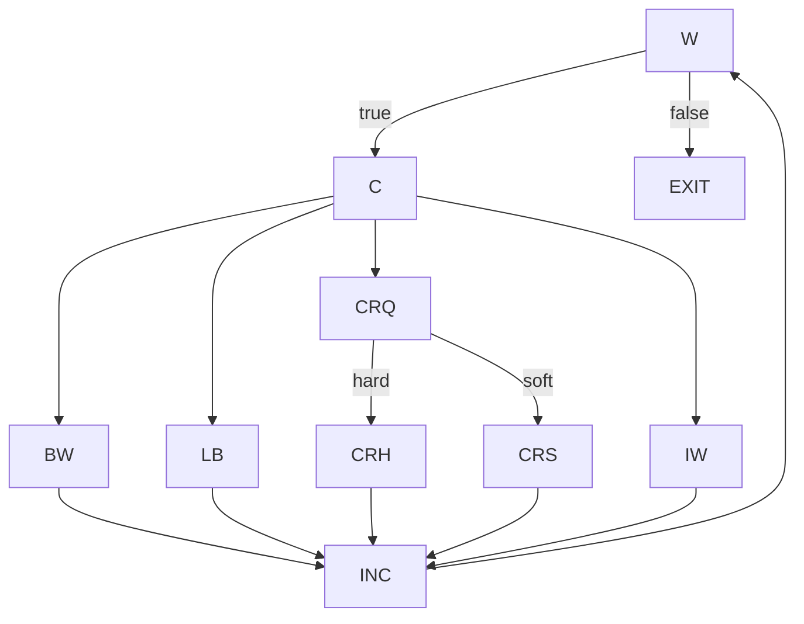

# Ejercicio 3

Se usa el metodo `fmtRewrap()` de:

- `tp4/assignmnet-4-rodeghiero/src/main/java/assignment4_exercises/FmtRewrap.java`

### Modelo de CFG usado en la resolucion

Para mantener el analisis legible, use un CFG de bloques:

- `W`: condicion del `while`
- `C`: clasificacion del caracter (if/else-if de `col`, `CR`, `' '`, `inWord`)
- `BW`: caso `betweenWord`
- `LB`: caso `lineBreak`
- `CR?`: caso `crFound` (decision interna)
- `CRh`: rama hard-CR (`i+1 < len && next == CR`)
- `CRs`: rama soft-CR (else)
- `IW`: caso `inWord/default`
- `INC`: `i++`
- `EXIT`: `S = new String(SArr) + CR; return`

Grafo:

### (a) CFG del metodo

Es el grafo anterior.

### (b) Test `t` que va de comienzo del `while` a `S = new String(SArr) + CR` sin cuerpo

Un caso valido es:

- `t = ("", 10)`

Con `S = ""`, al entrar al `while` se evalua `i < S.length()` como `0 < 0` (falso), por lo que se toma directamente el arco `W -> EXIT`.

### (c) Requisitos de tests para NC, EC y PPC

NC (nodos):

- `{W, C, BW, LB, CR?, CRh, CRs, IW, INC, EXIT}`

EC (arcos):

1. `(W,C)`
2. `(W,EXIT)`
3. `(C,BW)`
4. `(C,LB)`
5. `(C,CR?)`
6. `(C,IW)`
7. `(BW,INC)`
8. `(LB,INC)`
9. `(CR?,CRh)`
10. `(CR?,CRs)`
11. `(CRh,INC)`
12. `(CRs,INC)`
13. `(IW,INC)`
14. `(INC,W)`

PPC (caminos principales del CFG reducido): 47 requisitos

1. `[W, C, BW, INC, W]`
2. `[W, C, LB, INC, W]`
3. `[W, C, IW, INC, W]`
4. `[W, C, CR?, CRh, INC, W]`
5. `[W, C, CR?, CRs, INC, W]`
6. `[C, BW, INC, W, C]`
7. `[C, BW, INC, W, EXIT]`
8. `[C, LB, INC, W, C]`
9. `[C, LB, INC, W, EXIT]`
10. `[C, IW, INC, W, C]`
11. `[C, IW, INC, W, EXIT]`
12. `[C, CR?, CRh, INC, W, C]`
13. `[C, CR?, CRh, INC, W, EXIT]`
14. `[C, CR?, CRs, INC, W, C]`
15. `[C, CR?, CRs, INC, W, EXIT]`
16. `[BW, INC, W, C, BW]`
17. `[BW, INC, W, C, LB]`
18. `[BW, INC, W, C, IW]`
19. `[BW, INC, W, C, CR?, CRh]`
20. `[BW, INC, W, C, CR?, CRs]`
21. `[LB, INC, W, C, BW]`
22. `[LB, INC, W, C, LB]`
23. `[LB, INC, W, C, IW]`
24. `[LB, INC, W, C, CR?, CRh]`
25. `[LB, INC, W, C, CR?, CRs]`
26. `[CR?, CRh, INC, W, C, BW]`
27. `[CR?, CRh, INC, W, C, LB]`
28. `[CR?, CRh, INC, W, C, CR?]`
29. `[CR?, CRh, INC, W, C, IW]`
30. `[CR?, CRs, INC, W, C, BW]`
31. `[CR?, CRs, INC, W, C, LB]`
32. `[CR?, CRs, INC, W, C, CR?]`
33. `[CR?, CRs, INC, W, C, IW]`
34. `[CRh, INC, W, C, CR?, CRh]`
35. `[CRh, INC, W, C, CR?, CRs]`
36. `[CRs, INC, W, C, CR?, CRh]`
37. `[CRs, INC, W, C, CR?, CRs]`
38. `[IW, INC, W, C, BW]`
39. `[IW, INC, W, C, LB]`
40. `[IW, INC, W, C, IW]`
41. `[IW, INC, W, C, CR?, CRh]`
42. `[IW, INC, W, C, CR?, CRs]`
43. `[INC, W, C, BW, INC]`
44. `[INC, W, C, LB, INC]`
45. `[INC, W, C, IW, INC]`
46. `[INC, W, C, CR?, CRh, INC]`
47. `[INC, W, C, CR?, CRs, INC]`

### (d) Suite para NC pero no EC

Suite implementada:

- `tp4/assignmnet-4-rodeghiero/src/test/java/assignment4_exercises/FmtRewrapNodeCoverageTest.java`

Comando usado:

- `JAVA_HOME=$(/usr/libexec/java_home -v 17) mvn -Dmaven.repo.local=.m2 -Dtest=FmtRewrapNodeCoverageTest test`

Resultado JaCoCo para `fmtRewrap`:

- `LINE: 29/29`
- `BRANCH: 16/16`

Observacion importante: con esta implementacion y este nivel de modelado, la suite que cubre todos los nodos de sentencias tambien termina cubriendo todos los arcos medidos por la herramienta. Es decir, en la practica de este metodo no se pudo mantener `NC` sin `EC` al mismo tiempo con JaCoCo.

### (e) Suite para EC pero no PPC

Suite implementada:

- `tp4/assignmnet-4-rodeghiero/src/test/java/assignment4_exercises/FmtRewrapEdgeButNotPrimePathCoverageTest.java`

Comando usado:

- `JAVA_HOME=$(/usr/libexec/java_home -v 17) mvn -Dmaven.repo.local=.m2 -Dtest=FmtRewrapEdgeButNotPrimePathCoverageTest test`

Resultado JaCoCo para `fmtRewrap`:

- `LINE: 29/29`
- `BRANCH: 16/16`  (equivalente practico de EC en esta herramienta)

Por que no es PPC (sobre el CFG definido arriba):

- Esta suite no recorre el prime path `[BW, INC, W, C, IW]`.
- Intuitivamente, cuando entra a `BW` en la suite de (e), el siguiente paso vuelve por `LB` y no por `IW`.

### (f) Suite para PPC con Best Effort Touring

Suite implementada:

- `tp4/assignmnet-4-rodeghiero/src/test/java/assignment4_exercises/FmtRewrapPrimePathBestEffortCoverageTest.java`

Comando usado:

- `JAVA_HOME=$(/usr/libexec/java_home -v 17) mvn -Dmaven.repo.local=.m2 -Dtest=FmtRewrapPrimePathBestEffortCoverageTest test`

Resultado JaCoCo para `fmtRewrap`:

- `LINE: 29/29`
- `BRANCH: 16/16`

Analisis de prime paths en el CFG definido:

- Prime paths totales: `47`
- Paths cubiertos directamente por la suite: `43`
- No cubiertos: `4`, y son infeasibles por semantica del metodo:
1. `[CR?, CRh, INC, W, C, LB]`
2. `[CR?, CRs, INC, W, C, CR?]`
3. `[CRs, INC, W, C, CR?, CRh]`
4. `[CRs, INC, W, C, CR?, CRs]`

Justificacion breve de infeasibilidad:

- Luego de `CRh`, el codigo fuerza `col = 1`; forzar `LB` inmediatamente despues requiere un `N` muy chico que haria imposible haber tomado `CRh` en la iteracion previa (por precedencia de `col >= N`).
- `CRs` implica que el siguiente caracter inmediato **no** es `CR`; por eso no puede ocurrir un nuevo `CR?` en la iteracion inmediatamente siguiente.

Conclusión:

- La suite de (f) cumple PPC bajo `Best Effort Touring`: cubre todos los prime paths factibles directamente y deja afuera solo los infeasibles, manteniendo ademas cobertura total de arcos en JaCoCo.

