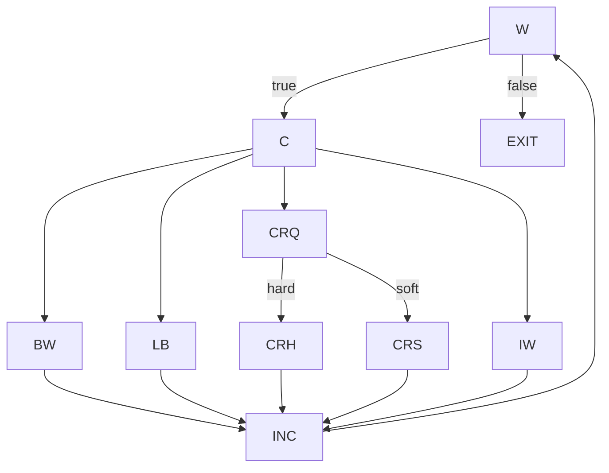

# Ejercicio 3 — CFG de `fmtRewrap` y suites para NC, EC, PPC

Trabajo sobre `fmtRewrap()` (en `assignmnet-4-rodeghiero/src/main/java/assignment4_exercises/FmtRewrap.java`).

## CFG por bloques

Para que el análisis sea manejable uso un CFG por bloques, no a nivel de instrucción individual. Los nodos:

- `W` — condición del `while`.
- `C` — clasificación del carácter actual (`if/else if` sobre `col`, `CR`, `' '`, `inWord`).
- `BW` — caso `betweenWord`.
- `LB` — caso `lineBreak`.
- `CR?` — caso `crFound`, que internamente toma una decisión.
- `CRh` — rama *hard-CR* (cuando `i+1 < len && next == CR`).
- `CRs` — rama *soft-CR* (rama `else` del anterior).
- `IW` — caso `inWord` (o `default`).
- `INC` — incremento `i++`.
- `EXIT` — `S = new String(SArr) + CR; return`.

CFG:



## (a) CFG del método

El CFG del método es exactamente el grafo de arriba.

## (b) Test que sale del `while` sin entrar al cuerpo

Un caso válido:

- `t = ("", 10)`

Con `S = ""` la condición del `while` evalúa `0 < 0` (falso), así que el flujo toma directamente `W → EXIT` sin pasar por ningún nodo intermedio.

## (c) Requisitos para NC, EC y PPC

**NC**: `{W, C, BW, LB, CR?, CRh, CRs, IW, INC, EXIT}`.

**EC** (14 arcos):

1. `(W, C)`
2. `(W, EXIT)`
3. `(C, BW)`
4. `(C, LB)`
5. `(C, CR?)`
6. `(C, IW)`
7. `(BW, INC)`
8. `(LB, INC)`
9. `(CR?, CRh)`
10. `(CR?, CRs)`
11. `(CRh, INC)`
12. `(CRs, INC)`
13. `(IW, INC)`
14. `(INC, W)`

**PPC**: 47 prime paths.

1. `[W, C, BW, INC, W]`
2. `[W, C, LB, INC, W]`
3. `[W, C, IW, INC, W]`
4. `[W, C, CR?, CRh, INC, W]`
5. `[W, C, CR?, CRs, INC, W]`
6. `[C, BW, INC, W, C]`
7. `[C, BW, INC, W, EXIT]`
8. `[C, LB, INC, W, C]`
9. `[C, LB, INC, W, EXIT]`
10. `[C, IW, INC, W, C]`
11. `[C, IW, INC, W, EXIT]`
12. `[C, CR?, CRh, INC, W, C]`
13. `[C, CR?, CRh, INC, W, EXIT]`
14. `[C, CR?, CRs, INC, W, C]`
15. `[C, CR?, CRs, INC, W, EXIT]`
16. `[BW, INC, W, C, BW]`
17. `[BW, INC, W, C, LB]`
18. `[BW, INC, W, C, IW]`
19. `[BW, INC, W, C, CR?, CRh]`
20. `[BW, INC, W, C, CR?, CRs]`
21. `[LB, INC, W, C, BW]`
22. `[LB, INC, W, C, LB]`
23. `[LB, INC, W, C, IW]`
24. `[LB, INC, W, C, CR?, CRh]`
25. `[LB, INC, W, C, CR?, CRs]`
26. `[CR?, CRh, INC, W, C, BW]`
27. `[CR?, CRh, INC, W, C, LB]`
28. `[CR?, CRh, INC, W, C, CR?]`
29. `[CR?, CRh, INC, W, C, IW]`
30. `[CR?, CRs, INC, W, C, BW]`
31. `[CR?, CRs, INC, W, C, LB]`
32. `[CR?, CRs, INC, W, C, CR?]`
33. `[CR?, CRs, INC, W, C, IW]`
34. `[CRh, INC, W, C, CR?, CRh]`
35. `[CRh, INC, W, C, CR?, CRs]`
36. `[CRs, INC, W, C, CR?, CRh]`
37. `[CRs, INC, W, C, CR?, CRs]`
38. `[IW, INC, W, C, BW]`
39. `[IW, INC, W, C, LB]`
40. `[IW, INC, W, C, IW]`
41. `[IW, INC, W, C, CR?, CRh]`
42. `[IW, INC, W, C, CR?, CRs]`
43. `[INC, W, C, BW, INC]`
44. `[INC, W, C, LB, INC]`
45. `[INC, W, C, IW, INC]`
46. `[INC, W, C, CR?, CRh, INC]`
47. `[INC, W, C, CR?, CRs, INC]`

## (d) Suite NC pero no EC

Suite en `FmtRewrapNodeCoverageTest.java`. Comando:

```bash
JAVA_HOME=$(/usr/libexec/java_home -v 17) mvn -Dmaven.repo.local=.m2 \
    -Dtest=FmtRewrapNodeCoverageTest test
```

JaCoCo sobre `fmtRewrap`: `LINE 29/29`, `BRANCH 16/16`.

**Lo que pasó:** con esta implementación particular y el nivel de modelado del CFG, una suite que cubre todos los nodos termina cubriendo también todos los arcos que mide la herramienta. No conseguí una suite que satisfaga NC sin satisfacer EC al mismo tiempo, porque varias sentencias y ramas están tan acopladas que llegar al nodo implica recorrer también su arco saliente.

## (e) Suite EC pero no PPC

Suite en `FmtRewrapEdgeButNotPrimePathCoverageTest.java`. Comando:

```bash
JAVA_HOME=$(/usr/libexec/java_home -v 17) mvn -Dmaven.repo.local=.m2 \
    -Dtest=FmtRewrapEdgeButNotPrimePathCoverageTest test
```

JaCoCo: `LINE 29/29`, `BRANCH 16/16` (equivalente práctico de EC).

**Por qué no cumple PPC:** la suite no recorre el prime path `[BW, INC, W, C, IW]`. Cada vez que el flujo entra a `BW`, la siguiente iteración relevante del bucle pasa por `LB` en lugar de `IW`, así que esa secuencia particular no aparece nunca en los caminos ejecutados.

## (f) Suite PPC con *Best Effort Touring*

Suite en `FmtRewrapPrimePathBestEffortCoverageTest.java`. Comando:

```bash
JAVA_HOME=$(/usr/libexec/java_home -v 17) mvn -Dmaven.repo.local=.m2 \
    -Dtest=FmtRewrapPrimePathBestEffortCoverageTest test
```

JaCoCo: `LINE 29/29`, `BRANCH 16/16`.

**Análisis de prime paths sobre el CFG:**

- Total: 47.
- Cubiertos directamente: 43.
- No cubiertos: 4. Todos **infactibles** por la semántica del método:
  1. `[CR?, CRh, INC, W, C, LB]`
  2. `[CR?, CRs, INC, W, C, CR?]`
  3. `[CRs, INC, W, C, CR?, CRh]`
  4. `[CRs, INC, W, C, CR?, CRs]`

**Por qué son infactibles:**

- Después de `CRh` el código fija `col = 1`. Para que en la siguiente iteración se entre directamente a `LB` haría falta tener un `N` tan chico que en la iteración previa ya se hubiera disparado `col >= N` — y entonces no se habría podido tomar `CRh`. Las dos condiciones son mutuamente excluyentes.
- La rama `CRs` se toma cuando el siguiente carácter inmediato **no** es `CR`. Eso impide que en la iteración siguiente se vuelva a entrar al caso `CR?`, porque ese caso requiere detectar un nuevo `CR` justo ahí.

**Conclusión:** la suite cumple PPC bajo *Best Effort Touring*: cubre todos los prime paths factibles del CFG y los únicos 4 que quedan fuera son demostrablemente infactibles. Cobertura total de líneas y ramas.

## Archivos

- [`FmtRewrap.java`](https://github.com/tomirodeghiero/testing-de-software-unrc/blob/main/tp4/assignmnet-4-rodeghiero/src/main/java/assignment4_exercises/FmtRewrap.java)
- [`FmtRewrapNodeCoverageTest.java`](https://github.com/tomirodeghiero/testing-de-software-unrc/blob/main/tp4/assignmnet-4-rodeghiero/src/test/java/assignment4_exercises/FmtRewrapNodeCoverageTest.java) — suite (d).
- [`FmtRewrapEdgeButNotPrimePathCoverageTest.java`](https://github.com/tomirodeghiero/testing-de-software-unrc/blob/main/tp4/assignmnet-4-rodeghiero/src/test/java/assignment4_exercises/FmtRewrapEdgeButNotPrimePathCoverageTest.java) — suite (e).
- [`FmtRewrapPrimePathBestEffortCoverageTest.java`](https://github.com/tomirodeghiero/testing-de-software-unrc/blob/main/tp4/assignmnet-4-rodeghiero/src/test/java/assignment4_exercises/FmtRewrapPrimePathBestEffortCoverageTest.java) — suite (f).

## Enlaces

- Enunciado: [`practico4.pdf`](/pdfs/tp4/practico4.pdf)
- Resolución: [`resolucion_practico4.pdf`](/pdfs/tp4/resolucion_practico4.pdf)
